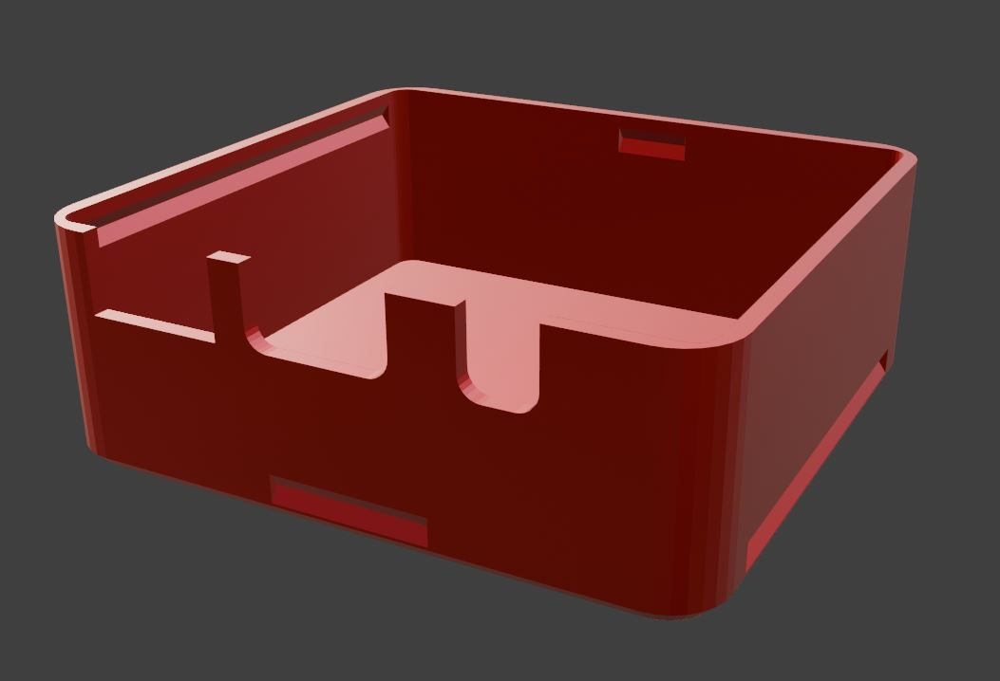

## TinyOfficial SlimeVR Case
*My edits of Gorbit99's TinySlime case to fit the Official SlimeVR PCB and battery, and an adaptation of Pixel_lily's original clip design that works with it!*

     
     

* Very simple and tiny cases, designed to fit the Official SlimeVR PCB and battery with no modifications needed.
* Open or closed top option, with clip backplate  allowing for easy removing.
* v1.2 featured above, has angled straploops for optimal ankle use.
* BNO085 Official PCB
* SlimeVR's default standard Battery.
* I used PLA at first, but PETG is better I found.
* Additional details for printing, if needed, can be found on Gorbit99's TinySlime repository!

## NOTES:
Updated to v1.1, made the clip groove on the bottom case smaller to avoid the tracker sliding side to side on it.

Updated to v1.2, made the groove and clip parts on the bottom case longer to give more stability and durability. Clip has angled strap loops.

TinySlime
[Github](https://github.com/gorbit99/tiny-slime/)

INSTRUCTIONS:

1. Carefully unscrew the two screws of the Official Slime tracker, remove PCB and battery from the case.

2. When fitting the battery, rotate it so the long wires are on the right side.

IMPORTANT: FOAM PAD MUST BE
BETWEEN PCB AND BATTERY!

 Be very careful with the battery connector on the PCB too!

TIP: I found shaping the wires first before putting it in helped, and a fingertip on the battery connector so it doesn't bend up when pushing the wires into place is recommended. (circled below)

*TinyOfficial Case*

*TinyOfficial Case v1.1*

*TinyOfficial Closed Top*

*TinyOfficial Open Top*

*TinyOfficial Clip*

*Completed TinyOfficial Slimes!*
