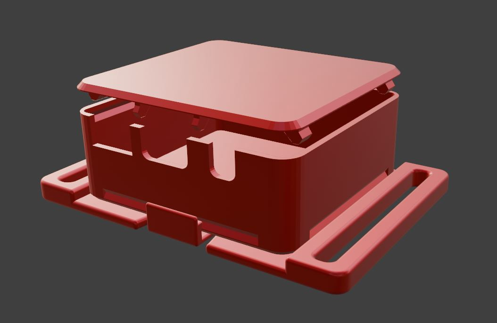

## TinyOfficial SlimeVR Case
*My edits of Gorbit99's TinySlime case to fit the Official SlimeVR PCB and battery, and of Pixel's clip design that works with it!*

* Very simple and tiny PCB case, designed to fit the Official SlimeVR PCB and battery with no modifications needed.
* Open or closed top option, with clip on feature allowing for easy removing.
* BNO085 Official PCB
* SlimeVR's default standard Battery.
* I used PLA for this without issues.
* Additional details for printing, if needed, can be found on Gorbit99's TinySlime repository!

[Github](https://github.com/gorbit99/tiny-slime/)

INSTRUCTIONS:

1. Carefully unscrew the two screws of the Official Slime tracker, remove PCB and battery from the case.

2. When fitting the battery, rotate it so the long wires are on the right side.

IMPORTANT: FOAM PAD MUST BE
BETWEEN PCB AND BATTERY!

 Be very careful with the battery connector on the PCB too!

TIP: I found shaping the wires first before putting it in helped, and a fingertip on the battery connector so it doesn't bend up when pushing the wires into place is recommended. (circled below)

*TinyOfficial Case*

*TinyOfficial Closed Top*

*TinyOfficial Open Top*

*TinyOfficial Clip*

*Completed TinyOfficial Slimes!*
